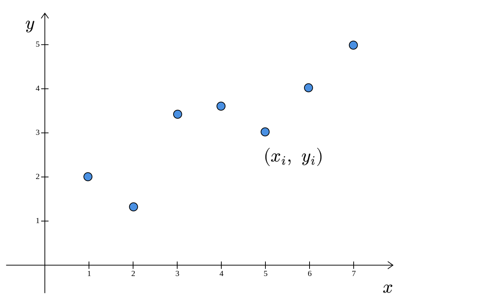
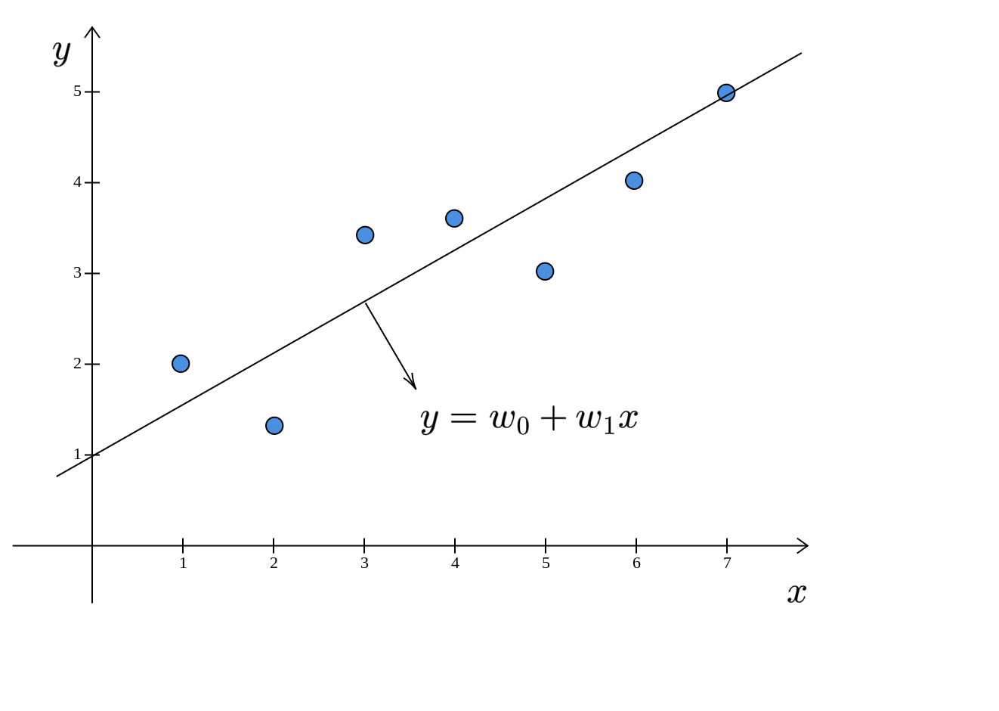
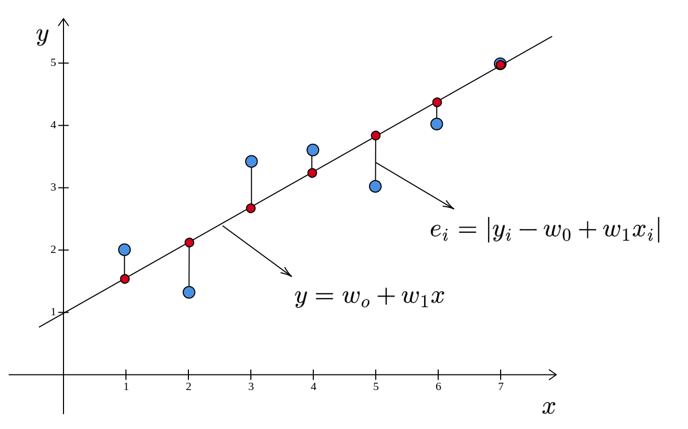

::: {.callout-note title="Question"}
What does a linear model look like?
:::

## 1-D Problem

Let us return to the housing dataset. We are trying to predict the selling price of a house based on some features or attributes. We started with six of these attributes. Along with the constant term, we have seven parameters for the linear model: $\mathbf{w} =[w_{0} ,\cdots ,w_{6} ]^{T}$. If we think about the points in the labeled dataset, each of them can be represented as a point in seven dimensional space: $[x_{1} ,\cdots ,x_{6} ,y]^{T}$. This is impossible to visualize. To make the visualization problem more tractable, let us reduce the number of features to one. In this case, the dataset is a set of points in 2D space. If there are seven houses in the dataset, then we have seven points:

$$
\begin{equation*}
(x_{1} ,y_{1} ),\cdots ,(x_{7} ,y_{7} )
\end{equation*}
$$

Each house is represented by a pair of numbers: $(x,y)$. Let us say that $x$ is the area and $y$​ is the selling price. If we plot these points in 2D space, we have:

The linear model is:

$$
\begin{equation*}
y=w_{0} +w_{1} x
\end{equation*}
$$

Here, $\displaystyle y$ and $\displaystyle x$ are used in the sense of general variables and not particular values. So, what does this model look like? This is nothing but the equation of a line:

The linear model is a line. Recall that we are trying to find that line (model) which minimizes the sum of the squared errors. First, let us see what the errors look like in this diagram. The error is the difference between the predicted selling price ($w_{0} +w_{1} x$) and the actual selling price $(y)$:

$$
\begin{equation*}
e= |y-( w_{0} +w_{1} x)|
\end{equation*}
$$

The red points represent the predicted selling prices. The errors are the lengths of the vertical line segments connecting the blue points and the corresponding red points.

::: {.callout-note title="Remark"}
The error is parallel to the $y$-axis and is not perpendicular to the line.
:::

For various values of $\mathbf{w} =[ w_{0} ,w_{1}]^{T}$, we will get different lines. The line for which the sum of the squared errors is minimum is called the best-fit line. For a problem having one feature:

- the dataset resides in 2D space 
- the model is a line, a one-dimensional object embedded in a two-dimensional space.

## Higher dimensions

What about higher dimensions? If there are two features, we will have a best-fit plane:

$$
\begin{equation*}
y=w_{0} +w_{1} x_{1} +w_{2} x_{2}
\end{equation*}
$$

Here, $x_{i}$s are the features, $y$ is the predicted selling price of a house. Again, note that we are using $y$ and $x_{i}$s in the sense of variables to define the equation of a curve. This plane is a two-dimensional object that is embedded in 3D space. In general, if there are $d$ features, we have a $d$-dimensional hyperplane embedded in $d+1$ dimensional space. The equation of this hyperplane is given by:

$$
\begin{equation*}
y=w_{0} +w_{1} x_{1} +\cdots +w_{d} x_{d}
\end{equation*}
$$

Visualizing this hyperplane is beyond the scope of human abilities. So we typically restrict ourselves to 2 or 3 dimensions for building visual intuition.

## Summary

In a linear regression problem that has $d$ features and a real valued label, we can think of the points as residing in a $d+1$ dimensional space. We try to find a $d$-dimensional hyperplane embedded in this $d+1$ dimensional space that minimizes the sum of the squared errors between the predicted labels and the actual labels. This hyperplane is the best-fit for the points in the labeled dataset.