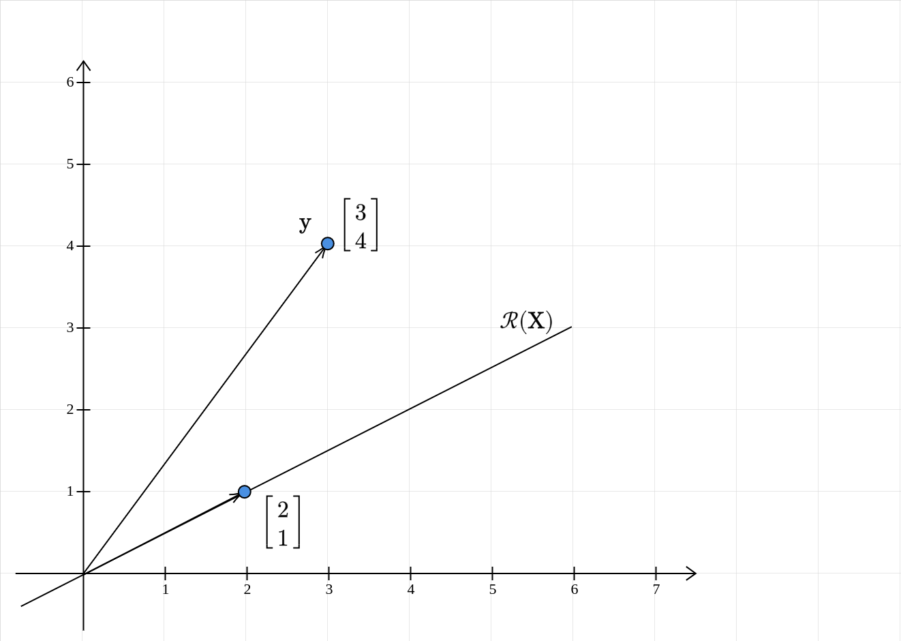
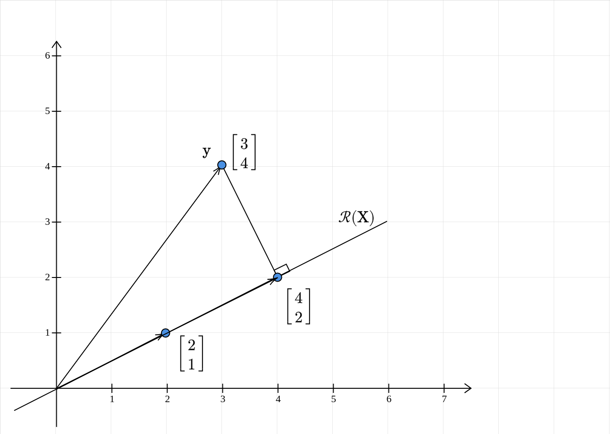
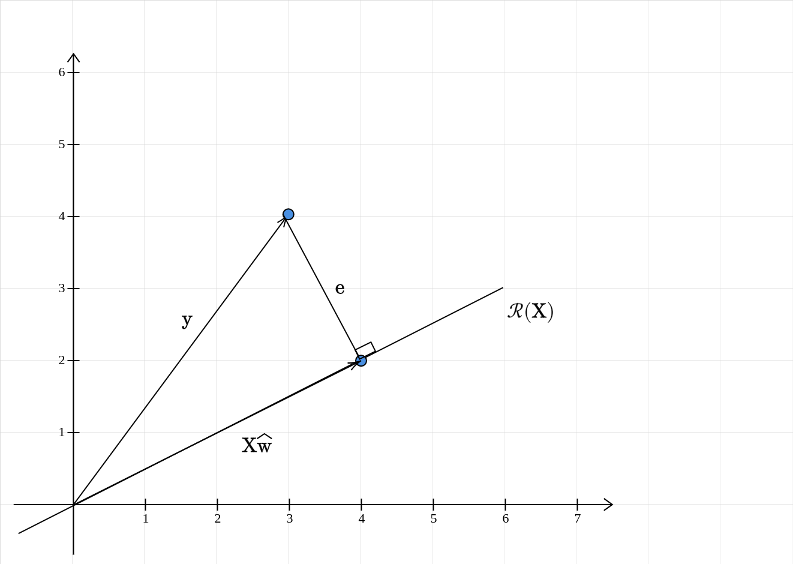

::: {.callout-note title="Question"}
Geometrically, what is the relationship between the approximation $\mathbf{X}\widehat{\mathbf{w}}$ and the vector $\mathbf{y}$?
:::

## Setting

Recall that we are trying to solve the following:

$$
\begin{equation*}
\mathbf{Xw} \approx \mathbf{y}
\end{equation*}
$$

The best approximation is given by the solution to this equation:

$$
\begin{equation*}
(\mathbf{X}^{T}\mathbf{X} )\widehat{\mathbf{w}} =\mathbf{X}^{T}\mathbf{y}
\end{equation*}
$$

$\mathbf{X}\widehat{\mathbf{w}}$ is therefore the best approximation for $\mathbf{y}$. Now, how are these two vectors related? Specifically, note that both vectors reside in $\mathbb{R}^{n}$. To keep things simple, let us return to our favorite haunt, $\mathbb{R}^{2}$, with the following configuration:

$$
\begin{equation*}
\mathbf{X} =\begin{bmatrix}
2 & 6\\
1 & 3
\end{bmatrix} ,\ \mathbf{y} =\begin{bmatrix}
3\\
4
\end{bmatrix}
\end{equation*}
$$

## Back to Column space

We look for an approximation only when $\mathbf{y}$ does not lie in the column space of $\mathbf{X}$. So, first, we see what the column space is:

$$
\begin{equation*}
\mathcal{R} (\mathbf{X} )=\text{span}\left(\left\{\begin{bmatrix}
2\\
1
\end{bmatrix}\right\}\right)
\end{equation*}
$$

The second column of $\mathbf{X}$ is just three times the first column. The rank of the matrix is $1$. The column space of $\mathbf{X}$ is a one-dimensional subspace of $\mathbb{R}^{2}$ . Geometrically, what does this mean?

The column space is a line passing through the origin and the point $(2,1)$. Clearly, the vector $\mathbf{y}$ does not lie in the column space of $\mathbf{X}$. So, we are justified in looking for an approximation.

## Projections: 2-dimensions

The key idea to remember is that the approximation is going to lie in the column space of $\mathbf{X}$. What vector in $\mathcal{R} (\mathbf{X} )$ is closest to to $\mathbf{y}$?  Even before going there, what do we mean by closest? Recall that the Euclidean distance between the two vectors is our measure of distance. In our 2D case, this is nothing but the distance between the point $\mathbf{y}$ and some point on the line $\mathcal{R} (\mathbf{X} )$. The point on the line which is going to have the shortest distance is the projection of $\mathbf{y}$ onto the line! Why is that the case? Among all line segments from a point to a line, the perpendicular to it is the shortest.

Geometric intuition therefore suggests that $\mathbf{X}\widehat{\mathbf{w}} =\begin{bmatrix}
4\\
2
\end{bmatrix}$.

## Back to Normal Equations

Let us see if algebra agrees with geometry:

$$
\begin{equation*}
\begin{aligned}
(\mathbf{X}^{T}\mathbf{X} )\widehat{\mathbf{w}} & =\mathbf{X}^{T}\mathbf{y}\\
 & \\
\begin{bmatrix}
2 & 1\\
6 & 3
\end{bmatrix}\begin{bmatrix}
2 & 6\\
1 & 3
\end{bmatrix}\begin{bmatrix}
\widehat{w}_{1}\\
\widehat{w}_{2}
\end{bmatrix} & =\begin{bmatrix}
2 & 1\\
6 & 3
\end{bmatrix}\begin{bmatrix}
3\\
4
\end{bmatrix}\\
 & \\
\begin{bmatrix}
5 & 15\\
15 & 45
\end{bmatrix}\begin{bmatrix}
\widehat{w}_{1}\\
\widehat{w}_{2}
\end{bmatrix} & =\begin{bmatrix}
10\\
30
\end{bmatrix}\\
 & \\
\begin{bmatrix}
1 & 3\\
1 & 3
\end{bmatrix}\begin{bmatrix}
\widehat{w}_{1}\\
\widehat{w}_{2}
\end{bmatrix} & =\begin{bmatrix}
2\\
2
\end{bmatrix}
\end{aligned}
\end{equation*}
$$

We see that $\mathbf{X}^{T}\mathbf{X}$ is singular. But thankfully, the system is still solvable. One such solution is:

$$
\begin{equation*}
\widehat{\mathbf{w}} =\begin{bmatrix}
-1\\
1
\end{bmatrix}
\end{equation*}
$$

Therefore, the approximation is:

$$
\begin{equation*}
\mathbf{X}\widehat{\mathbf{w}} =\begin{bmatrix}
2 & 6\\
1 & 3
\end{bmatrix}\begin{bmatrix}
-1\\
1
\end{bmatrix} =\begin{bmatrix}
4\\
2
\end{bmatrix}
\end{equation*}
$$

Algebra does agree with geometry!

## Projections: higher dimensions

The main takeaway from the 2D case is this: the vector closest to $\mathbf{y}$ in the column space of $\mathbf{X}$ is its projection onto the column space of $\mathbf{X}$. This can be extended to any higher dimensional space. First, we note that for a projection, the error vector is orthogonal to the column space of $\mathbf{X}$:

The error vector $\mathbf{e}$ is:

$$
\begin{equation*}
\mathbf{e} =\mathbf{y} -\mathbf{X}\widehat{\mathbf{w}}
\end{equation*}
$$

This is orthogonal to the column space of $\mathbf{X}$. This is the same as saying that it is orthogonal to each column of $\mathbf{X}$. If we let $\mathbf{X}$ to be $[\mathbf{c}_{1} ,\cdots ,\mathbf{c}_{d} ]$. Then for $1\leqslant i\leqslant d$:

$$
\begin{equation*}
\mathbf{c}_{i}^{T}\mathbf{e} =0
\end{equation*}
$$

This can be neatly expressed as:

$$
\begin{equation*}
\mathbf{X}^{T}\mathbf{e} =\mathbf{0}
\end{equation*}
$$

This means that the error vector is in the nullspace of $\mathbf{X}^{T}$. Replacing $\mathbf{e} =\mathbf{y} -\mathbf{X}\widehat{\mathbf{w}}$, we get:

$$
\begin{equation*}
\begin{aligned}
\mathbf{X}^{T} (\mathbf{y} -\mathbf{X}\widehat{\mathbf{w}} ) & =0\\
\Longrightarrow (\mathbf{X}^{T}\mathbf{X} )\widehat{\mathbf{w}} =\mathbf{X}^{T}\mathbf{y} & 
\end{aligned}
\end{equation*}
$$

The normal equations again!

## Summary

If the parameters of the linear model obtained by solving the normal equations is $\widehat{\mathbf{w}}$, then the vector $X\widehat{\mathbf{w}}$ is the projection of the vector $\mathbf{y}$ onto the column space of $\mathbf{X}$.