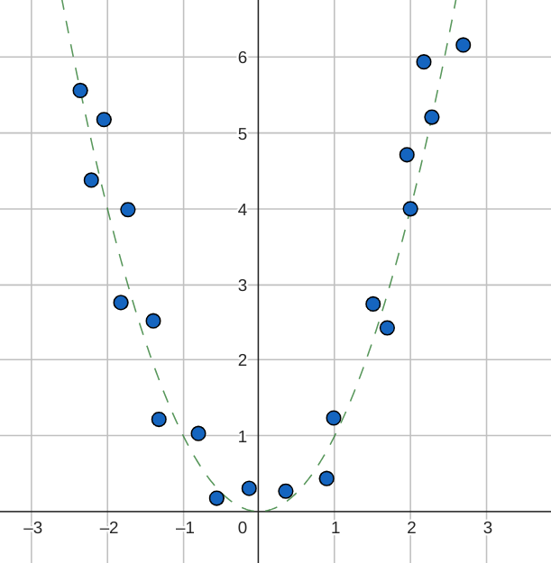

## Datasets with huge dimensions

Let $X$ be a data-matrix of dimensions $d\times n$ with $d\gg n$. The covariance matrix is of size $d\times d$. The computational cost of eigen-decomposition of a $d\times d$ matrix is $O(d^{3})$. So running PCA as it is may be prohibitively large for datasets with a huge number of dimensions. To get around this problem, we make use of the following fact:

::: {.callout-important title="Lemma"}

If $(\lambda,v)$ is an eigenpair of $X^{T}X$ with $\lambda\neq0$, then $(\lambda,Xv)$ is an eigenpair of $XX^{T}$.

::: {.callout-note title="Proof" collapse=true}
$$
\begin{aligned}
\left(X^{T}X\right)v & =\lambda v\\
X\left(X^{T}X\right)v & =\lambda(Xv)\\
\left(XX^{T}\right)\left(Xv\right) & =\lambda(Xv)
\end{aligned}
$$

If $Xv$ is non-zero, then $(\lambda,Xv)$ is an eigenpair of $XX^{T}$. $Xv$ is indeed non-zero. If $Xv=0$, then $X^{T}Xv=0$, which would mean that $v$ is an eigenvector of $X^{T}X$ with eigenvalue $0$, which contradicts the fact that $\lambda\neq0$.

:::

:::

This result is useful because it provides a way to get the eigenpairs of $XX^{T}$ using the eigenpairs of $X^{T}X$. Since $X^{T}X$ is $n\times n$ and $n\ll d$, the cost of the eigen-decomposition of $X^{T}X$ would be $O(n^{3})$, which is more efficient than the $O(d^{3})$ for $XX^{T}$.

Let us now direct our attention to the matrix $X^{T}X$. First, we express $X$ and $X^{T}$ as follows:

$$
\begin{aligned}
X & =\begin{bmatrix}\vert &  & \vert\\
x_{1} & \cdots & x_{n}\\
\vert &  & \vert
\end{bmatrix} & X^{T}=\begin{bmatrix}- & x_{1}^{T} & -\\
 & \vdots\\
- & x_{n}^{T} & -
\end{bmatrix}
\end{aligned}
$$

Each element of $X^{T}X$ then is just the inner product (dot product here) between two data-points. If this is not clear, go back to the usual way of multiplying two matrices. The $i^{th}$ row of $X^{T}$ with the $j^{th}$ row of $X$ combine to give the $ij^{th}$ element of $X^{T}X$:

$$
\left(X^{T}X\right)_{ij}=x_{i}^{T}x_{j}
$$

We call this matrix $K$:

$$
K=X^{T}X
$$

This is often called the Gram matrix and is the matrix of pairwise inner products between the data-points and is of shape $n\times n$. Using a suitable algorithm, we can obtain the non-zero eigenvalues and the corresponding eigenvectors of $K$. If the rank of $K$ is $r$, then there will be $r$ non-zero eigenvalues. We can list the eignepairs in decreasing order of eigenvalues as:

$$
(\lambda_{1},v_{1}),\cdots,(\lambda_{r},v_{r})
$$

Note that the eigenvectors are orthonormal here. Specifically, $||v_{i}||=1$. Also note that $r\leq\min(d,n)$ and for the specific case we are looking at, that of $d\gg n$, we have $r\leq n$. Once we have the eigenpairs of the Gram matrix, we can compute the eigenpairs of $XX^{T}$ using the lemma proved in the beginning:

$$
(\lambda_{1},Xv_{1}),\cdots,(\lambda_{r},Xv_{r})
$$

These eigenvectors are orthogonal but not yet orthonormal. Hence we need to normalize them. Let us call the $i^{th}$ normalized eigenvectors of $XX^{T}$ $w_{i}$:

$$
\begin{aligned}
w_{i} & =\cfrac{Xv_{i}}{\left|\left|Xv_{i}\right|\right|}\\
\\ & =\cfrac{Xv_{i}}{\sqrt{v_{i}^{T}X^{T}Xv_{i}}}\\
\\ & =\cfrac{Xv_{i}}{\sqrt{v_{i}^{T}(X^{T}Xv_{i})}}\\
\\ & =\cfrac{Xv_{i}}{\sqrt{v_{i}^{T}(\lambda_{i}v_{i})}}\\
\\ & =\cfrac{Xv_{i}}{\sqrt{\lambda_{i}}}
\end{aligned}
$$

where we have used the fact that $v_{i}$ is a normalized eigenvector of $X^{T}X$ with a non-zero eigenvalue $\lambda_{i}$. Therefore, the eigenpairs of $XX^{T}$ with normalized eigenvectors are:

$$
\left(\lambda_{1},\cfrac{Xv_{1}}{\sqrt{\lambda_{1}}}\right),\cdots,\left(\lambda_{r},\cfrac{Xv_{r}}{\sqrt{\lambda_{r}}}\right)
$$

But we are not interested in just $XX^{T}$, but the covariance matrix $C$, which is $C=\cfrac{1}{n}XX^{T}$. Scaling a matrix retains the eigenvectors but scales the eigenvalues. So the eigenpairs of $C$ are:

$$
\left(\cfrac{\lambda_{1}}{n},\cfrac{Xv_{1}}{\sqrt{\lambda_{1}}}\right),\cdots,\left(\cfrac{\lambda_{r}}{n},\cfrac{Xv_{r}}{\sqrt{\lambda_{r}}}\right)
$$

## Non-linear Datasets

Most of the times, datasets are too complex to comfortably fit into a lower dimensional subspace. Datasets are in general structurally non-linear. Vanilla PCA may thus fail to capture a good representation. Or we may have to include a large number of principal components to capture $95\%$ of the variance, defeating the whole purpose of PCA.

One way to get around this problem is to think of a non-linear transformation of the features and hope that the transformed dataset has a linear structure in this larger feature space. This is not too naive an expectation. To see why this might work, consider the following dataset in $\mathbb{R}^{2}$:

There is a relationship between $x_{2}$ and $x_{1}$ which can roughly be captured as $x_{2}=x_{1}^{2}$. Consider the transformation below:

$$
\phi(x_{1},x_{2})=\begin{bmatrix}0\\
x_{1}\\
x_{1}^{2}-x_{2}
\end{bmatrix}
$$

This maps the data-points from $\mathbb{R}^{2}$ to $\mathbb{R}^{3}$, the plane to the space. But given the nature of the dataset, the transformed dataset would lie roughly along the y-axis in the 3d plane. Thus, the transformation $\phi$ has managed to convert a non-linear dataset in the original feature space to a linear dataset in the transformed space. In reality, things might not be so straightforward. Nevertheless, this gives us some intuition as to what transformations can do.

We can also look at one more transformation:

$$
\phi(x_{1,}x_{2})=\begin{bmatrix}x_{1}\\
x_{1}^{2}\\
x_{2}
\end{bmatrix}
$$

Consider the line $w^{T}x=0$, where $w=\begin{bmatrix}0\\
1\\
-1
\end{bmatrix}$ in the transformed space. Most of the transformed data-points are going to lie roughly along this line.

Proceeding with this idea, let us assume that there is a (potentially non-linear) map $\phi\,\,:\,\,$$\mathbb{R}^{d}\rightarrow\mathbb{R}^{D}$ that maps the feature space $\mathbb{R}^{d}$ to $\mathbb{R}^{D}$. The transformed data-matrix is $\phi(X)$:

$$
\phi(X)=\begin{bmatrix}\vert &  & \vert\\
\phi(x_{1}) & \cdots & \phi(x_{n})\\
\vert &  & \vert
\end{bmatrix}
$$

This is a $D\times n$ matrix. We can now proceed with PCA on the data-matrix $\phi(X)$. But what if $D$ is huge? After all, we are trying to move to a higher dimension and it is quite likely that $D$ would be huge for really complex datasets. So we go back to working with the Gram matrix like in section-1. There is another great advantage of this which will be discussed later. We will now define the Gram matrix as:

$$
K=\phi(X)^{T}\phi(X)
$$

The eigenpairs of the Gram matrix are:

$$
(\lambda_{1},v_{1}),\cdots,(\lambda_{r},v_{r})
$$

where $r$ is the rank of $K$. Note that $r\leq\min(D,n)$. From this, we can get hold of the eigenvalues and eigenvectors of the covariance matrix $C=\frac{1}{n}\phi(X)\phi(X)^{T}$ as:

$$
\left(\cfrac{\lambda_{1}}{n},\cfrac{\phi(X)v_{1}}{\sqrt{\lambda_{1}}}\right),\cdots,\left(\cfrac{\lambda_{r}}{n},\cfrac{\phi(X)v_{r}}{\sqrt{\lambda_{r}}}\right)
$$

All this is good if we know the precise form of the transformation $\phi$. But most often, we may not know what this transformation is. Even if we know this, we would have to compute it for every data-point.

The computationally intensive step here is the eigen-decomposition of the Gram matrix. So let us take a closer look at it. Notice that it has the form $\phi(X)^{T}\phi(X)$. For computing the Gram matrix, what we need is the pair-wise inner products in the transformed space. Is there any tool that will give us these inner products without having to explicitly compute $\phi(x)$? There is such a tool and it is called a kernel.

A kernel is a function $k:\mathbb{R}^{d}\times\mathbb{R}^{d}\rightarrow\mathbb{R}$, such that there exists a $\phi:\mathbb{R}^{d}\rightarrow\mathbb{R}^{D}$

$$
k(x_{1},x_{2})=\phi(x_{1})^{T}\phi(x_{2})
$$

This is a loose definition as the transformed space need not necessarily be finite dimensional. Besides, the inner product in the transformed space may not necessarily be the dot product.
